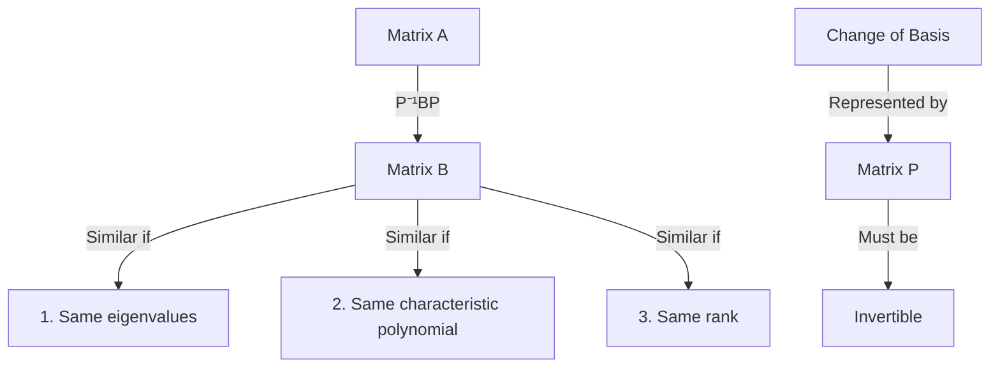
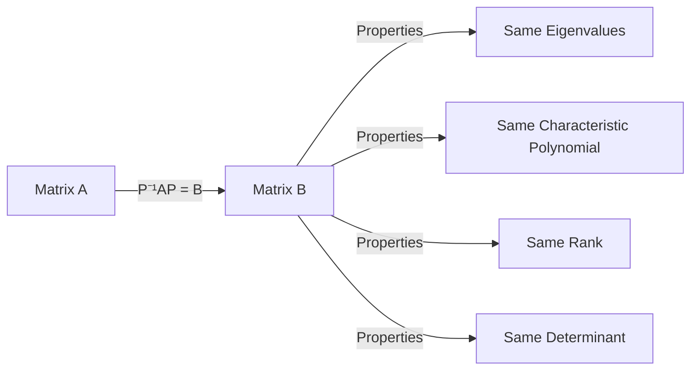

# Similar Matrices - Complete Guide

## Definition and Visual Representation

Two matrices A and B are similar if there exists an invertible matrix P such that: A = P⁻¹BP

```
┌──────────────┐              ┌──────────────┐
│              │    P⁻¹BP     │              │
│  Matrix A    │──────────────▶│  Matrix B    │
│              │              │              │
└──────────────┘              └──────────────┘

Similar matrices share:
┌─────────────────────────┐
│ 1. Same eigenvalues     │
│ 2. Same char polynomial │
│ 3. Same rank           │
└─────────────────────────┘

Matrix P must be:
┌─────────────┐
│ Invertible  │
│ det(P) ≠ 0  │
└─────────────┘
```




## Transformation Visualization

```
                    Properties Preserved
┌──────────┐                            ┌──────────┐
│ Matrix A │        P⁻¹AP = B          │ Matrix B │
└────┬─────┘                           └────┬─────┘
     │                                      │
     │           ┌─────────────┐           │
     └──────────▶│ Eigenvalues │◀──────────┘
     │           └─────────────┘           │
     │           ┌─────────────┐           │
     └──────────▶│ Determinant │◀──────────┘
     │           └─────────────┘           │
     │           ┌─────────────┐           │
     └──────────▶│    Rank    │◀──────────┘
                 └─────────────┘
```

## Matrix Similarity Visualization




## Key Properties

1. **Same Eigenvalues**
   - Similar matrices have identical eigenvalues
   - Algebraic multiplicities remain the same
   - Geometric multiplicities are preserved

2. **Characteristic Polynomial**
   - det(A - λI) = det(B - λI)
   - Proof:
     ```
     det(A - λI) = det(P⁻¹BP - λI)
                 = det(P⁻¹BP - P⁻¹PI)
                 = det(P⁻¹(B - λI)P)
                 = det(P⁻¹)det(B - λI)det(P)
                 = det(B - λI)
     ```

3. **Change of Basis Interpretation**
   - Matrix P represents a change of basis
   - Similar matrices represent the same linear transformation in different coordinate systems
   - P's columns form the basis vectors

4. **Other Shared Properties**
   - Rank
   - Determinant
   - Trace
   - Injectivity
   - Surjectivity

## Important Results

### Diagonalization
- Normal matrices (including self-adjoint matrices) are similar to diagonal matrices
- For matrix A to be diagonalizable:
  ```
  A = PDP⁻¹
  ```
  where D is diagonal matrix with eigenvalues

### Triangularization
- Every square matrix is similar to a triangular matrix
- Eigenvalues appear on the diagonal
- Known as Jordan normal form (advanced topic)

## Example
Given matrices:
```
A = [3  -1]
    [4  -5]

P = [2  1]
    [5  3]

P⁻¹ = [3   -1]
      [-5   2]
```

These matrices are similar if:
P⁻¹AP = B

This process preserves eigenvalues and characteristic polynomials while potentially changing the actual matrix entries.

## Transformation Process
1. Matrix A transforms to Matrix B using P⁻¹BP
2. P must be invertible for this to work

## Similar Matrices Share
- Same eigenvalues (λ)
- Same characteristic polynomial: det(A-λI)
- Same rank (dimension of output space)

## Matrix P's Role
- Represents change of basis
- Must be invertible (determinant ≠ 0)
- Acts as the transformation matrix between A and B
